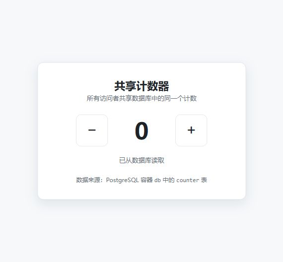
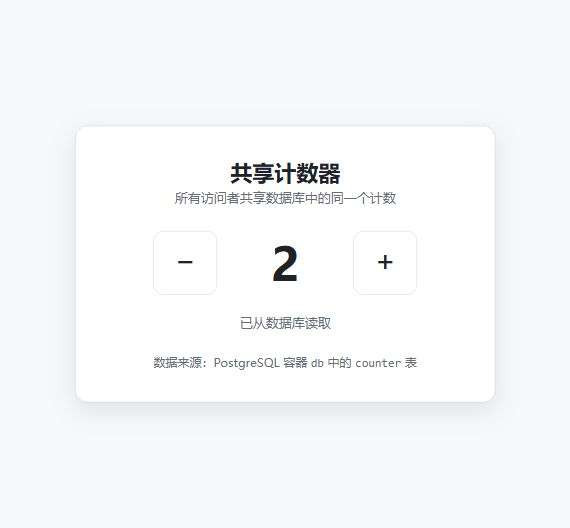
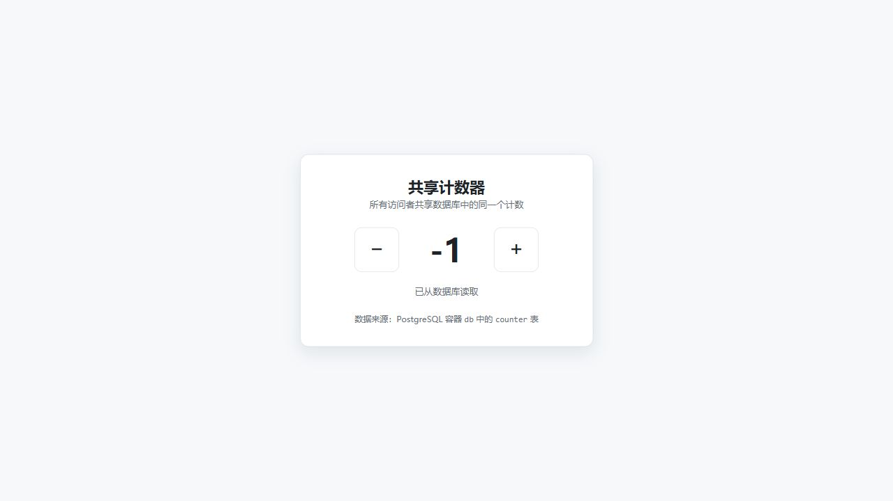
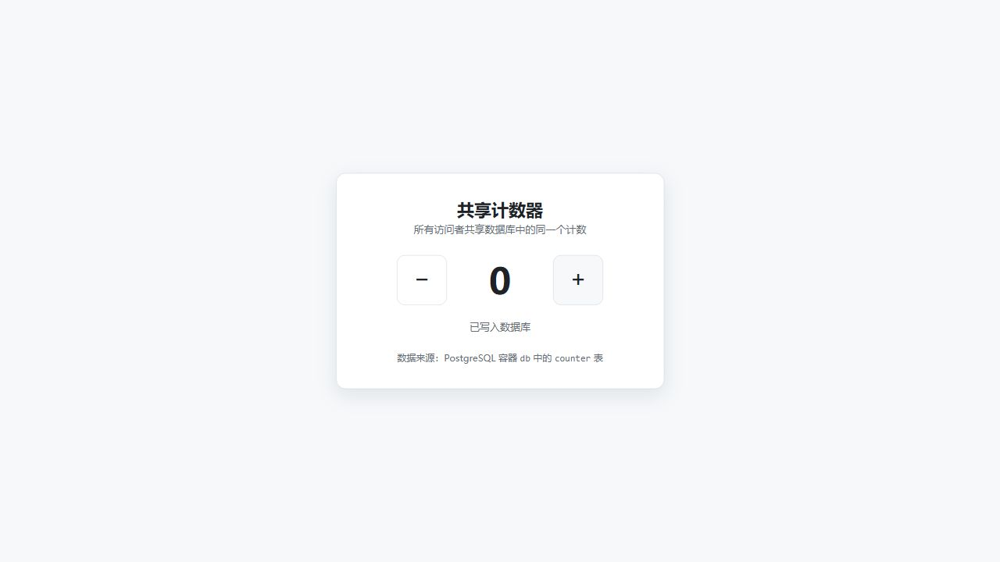
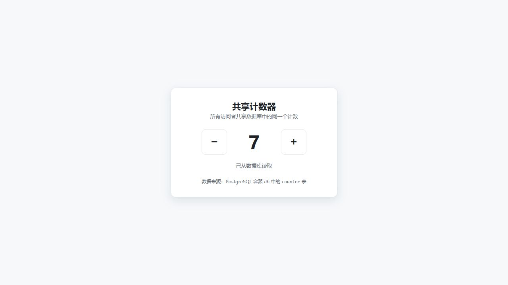
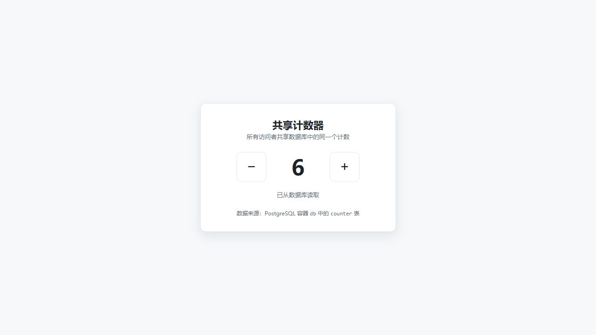
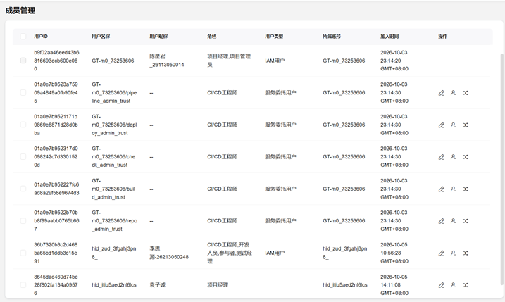

# Windows 验收记录（5.1—5.4 功能检查通过）

执行日期：2026-10-06（Asia/Shanghai）。环境配置于 2026-10-05 完成。验收人：陈星岩

## 代码与环境

本次使用 GitHub 仓库替代原流程中的 CodeArts 克隆地址。原因是 CodeArts 实名认证已经通过，但仍无法设置 SSH 密钥，导致无法通过 CodeArts 克隆仓库，因此改从 GitHub 获取同一项目完成验收。
https://github.com/CPLASF2049/Lab-1-Monorepo-Docker-Compose-.git

分支：`main`。
Commit SHA：`6d4afbc97c109abff93978f7da29f54ff9a522bf`。

确认 GitHub 仓库与 CodeArts 仓库的所有文件相同。本次据此验收上述固定提交；未独立执行两平台逐文件比对。刚克隆时工作区干净；运行验收未改动受版本控制的应用代码或配置。`.env` 由 `.env.example` 复制，使用默认值。

| 项目 | 实际值 |
| --- | --- |
| 系统 | Windows 10 专业版 64 位，10.0.19045 |
| Docker Engine | 29.8.2 / linux |
| Docker Compose | v5.5.1 |
| WSL | 2.7.13.0，WSL 2 |
| 页面 | http://localhost:8080 |
| 数据卷 | lab1-counter_db-data |

## 5.1 首次启动：通过

首次 `docker volume ls --filter name=lab1-counter_db-data` 仅返回表头，没有该项目数据卷。`docker compose config -q` 退出码为 0。

首次构建因 Docker Hub IPv6 认证连接超时失败。直接拉取 `node:22-alpine`、`nginx:1.27-alpine` 后，再执行 `docker compose up -d --build` 成功。frontend、backend、db 均运行，frontend 和 db 健康状态为 healthy。页面初始值为 0。

- [初值 0 截图](images/windows-validation/01-initial-0.jpg)
- [三个服务就绪输出](evidence/01-services.txt)

## 5.2 加减、刷新、跨浏览器和数据库：通过

内置浏览器真实点击加三次、减一次得到 2，刷新后仍为 2。用户在 Edge 无痕窗口打开同一地址，明确回复“打开有显示2”。该项为用户人工确认，没有留存无痕窗口截图。

随后在页面点击减三次得到 -1，刷新后仍为 -1。SQL 查询为 `id=1, value=-1`。

- [刷新后为 2](images/windows-validation/02-refresh-2.jpg)
- [刷新后为 -1](images/windows-validation/03-negative-refresh.jpg)
- [数据库 -1 查询原始输出](evidence/03-db-negative.txt)

## 5.3 服务重启：通过

执行 `docker compose restart` 成功；刷新页面仍为 -1，点击加一次后变成 0，说明重启后仍可写入。

- [重启后 -1](images/windows-validation/04-after-restart-negative.jpg)
- [重启后加至 0](images/windows-validation/05-after-restart-0.jpg)

## 5.4 删除容器后重建：通过

从 0 在页面加七次得到 7，数据库也为 7。记录旧容器 ID 后执行 `docker compose down`，确认项目容器全部消失，命名卷仍在。

数据卷删除容器前后均为：`lab1-counter_db-data 2026-10-05T16:31:55Z`。

重新执行 `docker compose up -d --build` 成功，三个新容器 ID 均不在旧 ID 列表中。刷新页面仍为 7，SQL 查询仍为 `id=1, value=7`，且 updated_at 未因重建改变。

| 服务（compose ID 输出顺序） | 旧 ID 前缀 | 新 ID 前缀 |
| --- | --- | --- |
| backend | 5e2fa9b3e1eb | 07082f80e8c9 |
| db | 30b7247828b8 | 165df03759eb |
| frontend | 8724fdab1ce4 | 4028ba8ea7fa |

完整 ID 见日志文件。用户已确认关闭旧无痕窗口、重新打开后显示 7（人工确认，未留存该窗口截图）。随后在页面点击减一次得到 6，刷新后仍为 6；SQL 查询为 id=1、value=6。最终三个服务均运行，frontend 和 db 为 healthy。功能验收于 2026-10-06 11:37（Asia/Shanghai）完成。

- [重建前页面为 7](images/windows-validation/06-before-recreate-7.jpg)
- [重建前数据库为 7](evidence/06-db-before.txt)
- [删除后无项目容器](evidence/07-after-down.txt)
- [旧容器完整 ID](evidence/windows-before-ids.txt)
- [新容器完整 ID](evidence/windows-after-ids.txt)
- [删除前卷信息](evidence/volume-before.txt)
- [删除后卷信息](evidence/volume-after-down.txt)
- [重建后页面为 7](images/windows-validation/08-after-recreate-7.jpg)
- [重建后数据库为 7](evidence/08-db-recreated.txt)

## 完整证据与提交材料

[本次执行日志](evidence/windows-validation-20261006.txt)保留实际命令输出、首次构建失败和成功重试。服务状态与 SQL 以原始文本日志留证，未制作终端截图。仓库原有 `docs/acceptance-evidence.txt` 是历史记录，不作为本次结果。

[环境配置过程](evidence/preparation-history.md)记录安装和重启过程；系统组件启用日志也保存在 evidence 中。

未执行删除数据卷操作。尚未提交或推送。CodeArts 项目名称 lab1-counter 和组员/助教加入截图已补齐；仓库级权限配置截图仍待补充，不能据此声明整个课程提交材料已完整。

## 最终结果

5.1—5.4 功能检查通过。页面和数据库最终均为 6，服务保留运行。

- [最终刷新后为 6](images/windows-validation/09-final-refresh-6.jpg)
- [最终数据库查询](evidence/09-db-final.txt)
- [最终服务状态](evidence/10-final-services.txt)

项目受版本控制的源码与配置无改动，验收 Commit SHA 保持不变。新增材料尚未提交或推送。

## 共享计数器页面配图

## 项目成员与分工

CodeArts 项目名称：lab1-counter。

| 成员 | 主要职责 | 实际分工 |
| --- | --- | --- |
| 陈星岩 | 验收与提交 | Lab 任务拆解、CodeArts 项目管理、新环境完整验收、代码勘正与细化、验收证据整理及提交材料汇总 |
| 李思源 | 代码开发 | Monorepo 仓库代码构筑、共享计数器完整功能实现、前后端 API 与 nginx 反向代理联调、Docker Compose 容器化部署及 PostgreSQL 初始化与持久化实现 |

上图由陈星岩提供，记录项目成员及角色，不等同于仓库级权限配置页面。代码工作主要由李思源承担，陈星岩主要负责验收与提交材料。李思源代码提交示例：3dc3d54、c2b1bf2、4e2c448、e5023fd。陈星岩本轮本地验收日志、截图与文档已形成，提交后补记对应 SHA。
